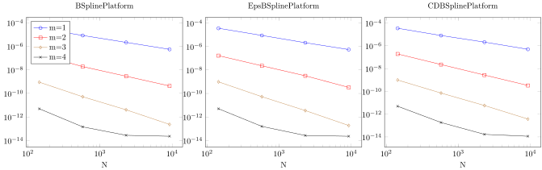

# ND B-spline extension


```@meta
DocTestSetup = quote
    using BSplineExtension, DomainSets  
end
```

The package provides a fast solver for multidimensional B-spline extensions such as, e.g.,
```jldoctest Ndframe
julia> P1 = ExtensionFramePlatform(NdBSplinePlatform((3,3)),(0.0..0.5)^2)
ExtensionFramePlatform(ProductPlatform{2}((BSplinePlatform{Float64,3}(), BSplinePlatform{Float64,3}())), 0.0..0.5 x 0.0..0.5)
julia> P2 = ExtensionFramePlatform(NdEpsBSplinePlatform((3,3)),(0.0..0.5)^2)
ExtensionFramePlatform(ProductPlatform{2}((EpsBSplinePlatform{Float64,3}(), EpsBSplinePlatform{Float64,3}())), 0.0..0.5 x 0.0..0.5)
julia> P3 = ExtensionFramePlatform(NdCDBSplinePlatform((3,3)),(0.0..0.5)^2)
ExtensionFramePlatform(ProductPlatform{2}((CDBSplinePlatform{Float64,3}(), CDBSplinePlatform{Float64,3}())), 0.0..0.5 x 0.0..0.5)
```

## Column truncation
In one dimensional B-spline extension approximation the nonzero columns of $$A-AZ'A$$
was independent of $$N$$. It is, however dependent on the size of the boundary of the domain. For two dimensional domains the number of nonzero rows is thus $$\mathcal O(\sqrt{N})$$.


[\[.pdf\]](figs/2dtruncated_size_1.pdf), [\[generated .tex\]](figs/2dtruncated_size_1.tex)


## Row truncation
Also the number of rows with a norm larger than epsilon is $$\mathcal O(\sqrt{N})$$ since the support of a B-spline is independent of $$N$$. In two dimension, the support is of the dual dictianary (as in `P1` and `P2`) is quite large. This is why the growth in nonzero rows is first $$\mathcal O(N)$$ in the region that is displayed below in the first two panels. Eventually, the  $$\mathcal O(\sqrt{N})$$ will be reached. For the compact dual splines the level off is reached at much lower $$N$$.


[\[.pdf\]](figs/2dtruncated_size_2.pdf), [\[generated .tex\]](figs/2dtruncated_size_2.tex)


# Multidimensional B-spline extension approximation
In this section we use the `BSplineExtensionSolver`](@ref) solver to approximate
the function $$f(x,y)=e^{x*y}$$ on the square $$[0,0.5]^2$$ using a B-spline basis of order
`m` on the interval $$[0,1]^2$$. First we show the convergence results, then the time complexity
of the approximation algorithm.
## Convergence
In the figure below, which shows the uniform error of approximating a 2 dimensional analytic function (details are in the introduction of this section),
 we see that convergence is algebraic.


[\[.pdf\]](figs/2derrors.pdf), [\[generated .tex\]](figs/2derrors.tex)



## Timings
For all platforms and for high $$N$$, the most costly part is the first step of the AZ algorithm, i.e., solving $$(A-AZ'A)x=(I-AZ')b$$.
The system is of size $$\mathcal O(n\times n) = \mathcal O(\sqrt{N}\times\sqrt{N})$$, where $$N$$ is the total number of
degrees of freedom and $$n$$ is the number of dof in one dimension. Therefore, solving this system and by consequence the approting a function costs
$$\mathcal O(n^3)=\mathcal O(N^{\frac{3}{2}})$$.

For low $$N$$ we saw that the first two platforms are not in the regime where the size of the system of $$\mathcal O(\sqrt{N}\times\sqrt{N})$$, they are $$\mathcal O({N}\times\sqrt{N})$$. We expect to see a $$\mathcal O(N^{2})$$ complexity. This complexity
is for small $$N$$ overshadowed by the $$\mathcal O({N^{\tfrac{3}{2}}})$$ cost of creating the system of
the first AZ step.


[\[.pdf\]](figs/2dtimings.pdf), [\[generated .tex\]](figs/2dtimings.tex)


